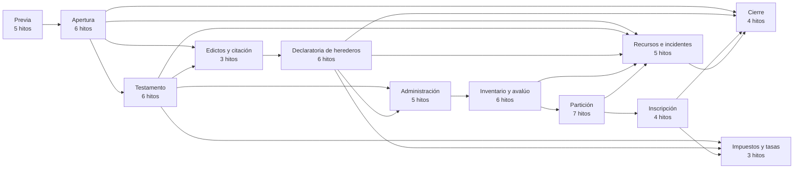

```mermaid
flowchart LR
  FASE_1["Previa<br/>5 hitos"]
  FASE_2["Apertura<br/>6 hitos"]
  FASE_3["Edictos y citación<br/>3 hitos"]
  FASE_4["Testamento<br/>6 hitos"]
  FASE_5["Declaratoria de herederos<br/>6 hitos"]
  FASE_6["Administración<br/>5 hitos"]
  FASE_7["Inventario y avalúo<br/>6 hitos"]
  FASE_8["Partición<br/>7 hitos"]
  FASE_9["Inscripción<br/>4 hitos"]
  FASE_10["Impuestos y tasas<br/>3 hitos"]
  FASE_11["Recursos e incidentes<br/>5 hitos"]
  FASE_12["Cierre<br/>4 hitos"]
  FASE_1 --> FASE_2
  FASE_2 --> FASE_11
  FASE_2 --> FASE_3
  FASE_2 --> FASE_4
  FASE_2 --> FASE_12
  FASE_3 --> FASE_5
  FASE_4 --> FASE_3
  FASE_4 --> FASE_11
  FASE_4 --> FASE_6
  FASE_4 --> FASE_10
  FASE_5 --> FASE_6
  FASE_5 --> FASE_10
  FASE_5 --> FASE_12
  FASE_5 --> FASE_11
  FASE_6 --> FASE_7
  FASE_7 --> FASE_8
  FASE_7 --> FASE_11
  FASE_8 --> FASE_9
  FASE_8 --> FASE_11
  FASE_9 --> FASE_10
  FASE_9 --> FASE_12
  FASE_11 --> FASE_12
```
