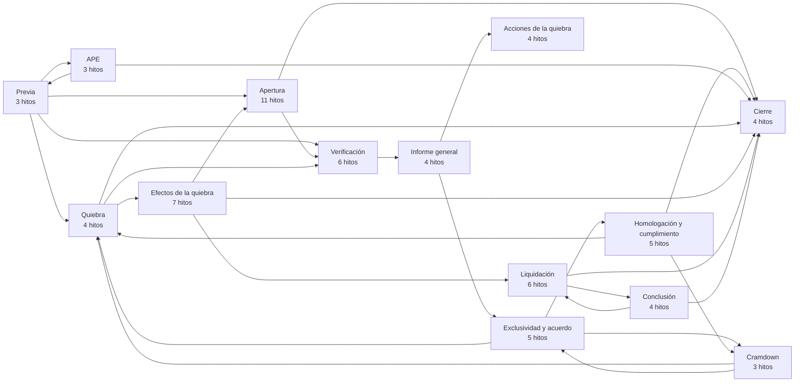

```mermaid
flowchart LR
  FASE_1["Previa<br/>3 hitos"]
  FASE_2["Apertura<br/>11 hitos"]
  FASE_3["Verificación<br/>6 hitos"]
  FASE_4["Informe general<br/>4 hitos"]
  FASE_5["Exclusividad y acuerdo<br/>5 hitos"]
  FASE_6["Homologación y cumplimiento<br/>5 hitos"]
  FASE_7["Cramdown<br/>3 hitos"]
  FASE_8["APE<br/>3 hitos"]
  FASE_9["Quiebra<br/>4 hitos"]
  FASE_10["Efectos de la quiebra<br/>7 hitos"]
  FASE_11["Acciones de la quiebra<br/>4 hitos"]
  FASE_12["Liquidación<br/>6 hitos"]
  FASE_13["Conclusión<br/>4 hitos"]
  FASE_14["Cierre<br/>4 hitos"]
  FASE_1 --> FASE_9
  FASE_1 --> FASE_3
  FASE_1 --> FASE_2
  FASE_1 --> FASE_8
  FASE_2 --> FASE_3
  FASE_2 --> FASE_14
  FASE_3 --> FASE_4
  FASE_4 --> FASE_11
  FASE_4 --> FASE_5
  FASE_5 --> FASE_7
  FASE_5 --> FASE_9
  FASE_5 --> FASE_6
  FASE_6 --> FASE_14
  FASE_6 --> FASE_7
  FASE_6 --> FASE_9
  FASE_7 --> FASE_9
  FASE_7 --> FASE_5
  FASE_8 --> FASE_14
  FASE_8 --> FASE_1
  FASE_9 --> FASE_14
  FASE_9 --> FASE_3
  FASE_9 --> FASE_10
  FASE_10 --> FASE_14
  FASE_10 --> FASE_2
  FASE_10 --> FASE_12
  FASE_12 --> FASE_13
  FASE_12 --> FASE_14
  FASE_13 --> FASE_14
  FASE_13 --> FASE_12
```
