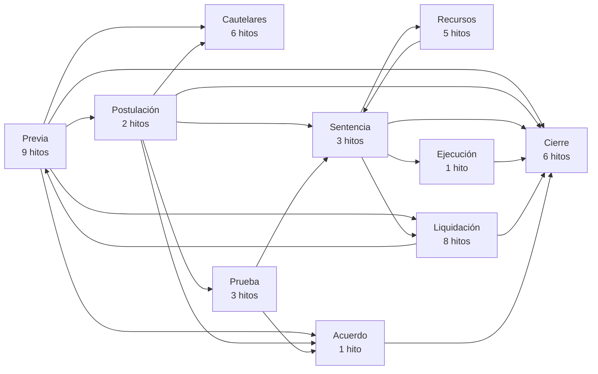

```mermaid
flowchart LR
  FASE_1["Previa<br/>9 hitos"]
  FASE_2["Cautelares<br/>6 hitos"]
  FASE_3["Postulación<br/>2 hitos"]
  FASE_4["Prueba<br/>3 hitos"]
  FASE_5["Sentencia<br/>3 hitos"]
  FASE_6["Recursos<br/>5 hitos"]
  FASE_7["Ejecución<br/>1 hito"]
  FASE_8["Liquidación<br/>8 hitos"]
  FASE_9["Acuerdo<br/>1 hito"]
  FASE_10["Cierre<br/>6 hitos"]
  FASE_1 --> FASE_8
  FASE_1 --> FASE_10
  FASE_1 --> FASE_3
  FASE_1 --> FASE_2
  FASE_1 --> FASE_9
  FASE_3 --> FASE_10
  FASE_3 --> FASE_2
  FASE_3 --> FASE_4
  FASE_3 --> FASE_5
  FASE_3 --> FASE_9
  FASE_4 --> FASE_9
  FASE_4 --> FASE_5
  FASE_5 --> FASE_6
  FASE_6 --> FASE_5
  FASE_5 --> FASE_10
  FASE_5 --> FASE_7
  FASE_7 --> FASE_10
  FASE_5 --> FASE_8
  FASE_8 --> FASE_1
  FASE_8 --> FASE_10
  FASE_9 --> FASE_10
```
