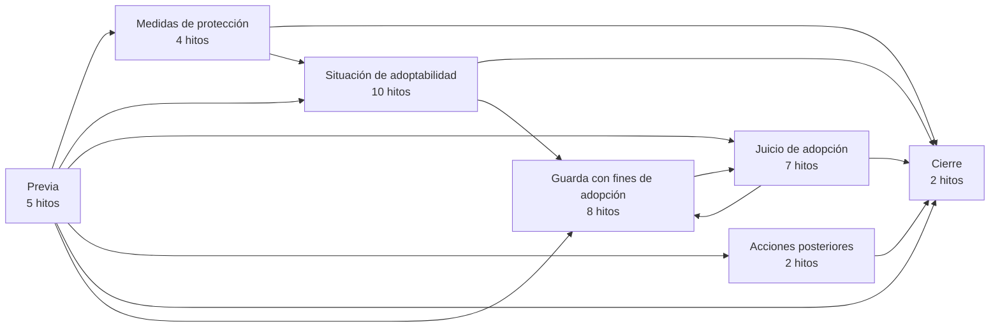

```mermaid
flowchart LR
  FASE_1["Previa<br/>5 hitos"]
  FASE_2["Medidas de protección<br/>4 hitos"]
  FASE_3["Situación de adoptabilidad<br/>10 hitos"]
  FASE_4["Guarda con fines de adopción<br/>8 hitos"]
  FASE_5["Juicio de adopción<br/>7 hitos"]
  FASE_6["Acciones posteriores<br/>2 hitos"]
  FASE_7["Cierre<br/>2 hitos"]
  FASE_1 --> FASE_2
  FASE_1 --> FASE_3
  FASE_1 --> FASE_5
  FASE_1 --> FASE_6
  FASE_1 --> FASE_7
  FASE_1 --> FASE_4
  FASE_2 --> FASE_7
  FASE_2 --> FASE_3
  FASE_3 --> FASE_7
  FASE_3 --> FASE_4
  FASE_4 --> FASE_5
  FASE_5 --> FASE_4
  FASE_5 --> FASE_7
  FASE_6 --> FASE_7
```
