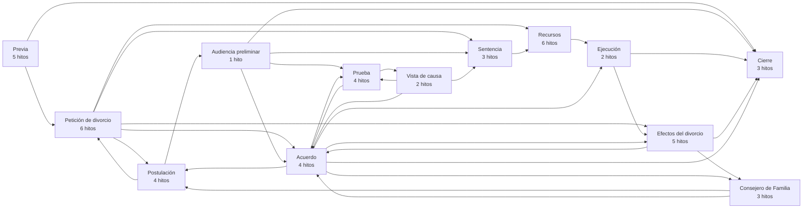

```mermaid
flowchart LR
  FASE_1["Previa<br/>5 hitos"]
  FASE_2["Petición de divorcio<br/>6 hitos"]
  FASE_3["Efectos del divorcio<br/>5 hitos"]
  FASE_4["Consejero de Familia<br/>3 hitos"]
  FASE_5["Postulación<br/>4 hitos"]
  FASE_6["Audiencia preliminar<br/>1 hito"]
  FASE_7["Prueba<br/>4 hitos"]
  FASE_8["Vista de causa<br/>2 hitos"]
  FASE_9["Sentencia<br/>3 hitos"]
  FASE_10["Recursos<br/>6 hitos"]
  FASE_11["Ejecución<br/>2 hitos"]
  FASE_12["Acuerdo<br/>4 hitos"]
  FASE_13["Cierre<br/>3 hitos"]
  FASE_1 --> FASE_13
  FASE_1 --> FASE_2
  FASE_4 --> FASE_5
  FASE_4 --> FASE_12
  FASE_2 --> FASE_5
  FASE_2 --> FASE_9
  FASE_2 --> FASE_10
  FASE_2 --> FASE_3
  FASE_2 --> FASE_12
  FASE_5 --> FASE_2
  FASE_5 --> FASE_6
  FASE_6 --> FASE_12
  FASE_6 --> FASE_7
  FASE_6 --> FASE_9
  FASE_6 --> FASE_13
  FASE_7 --> FASE_8
  FASE_7 --> FASE_12
  FASE_8 --> FASE_7
  FASE_8 --> FASE_12
  FASE_8 --> FASE_9
  FASE_9 --> FASE_10
  FASE_10 --> FASE_11
  FASE_11 --> FASE_3
  FASE_11 --> FASE_13
  FASE_3 --> FASE_13
  FASE_3 --> FASE_4
  FASE_3 --> FASE_12
  FASE_12 --> FASE_5
  FASE_12 --> FASE_7
  FASE_12 --> FASE_13
  FASE_12 --> FASE_11
  FASE_12 --> FASE_3
  FASE_12 --> FASE_4
```
