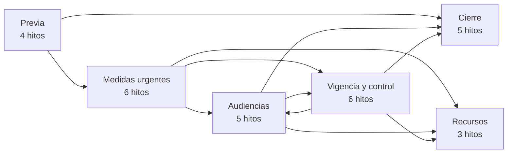

```mermaid
flowchart LR
  FASE_1["Previa<br/>4 hitos"]
  FASE_2["Medidas urgentes<br/>6 hitos"]
  FASE_3["Audiencias<br/>5 hitos"]
  FASE_4["Vigencia y control<br/>6 hitos"]
  FASE_5["Recursos<br/>3 hitos"]
  FASE_6["Cierre<br/>5 hitos"]
  FASE_1 --> FASE_2
  FASE_1 --> FASE_6
  FASE_2 --> FASE_3
  FASE_2 --> FASE_5
  FASE_2 --> FASE_4
  FASE_3 --> FASE_4
  FASE_3 --> FASE_5
  FASE_3 --> FASE_6
  FASE_4 --> FASE_6
  FASE_4 --> FASE_5
  FASE_4 --> FASE_3
```
