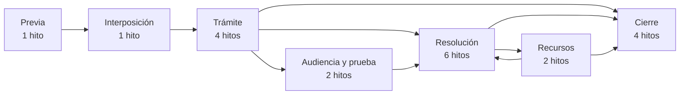

```mermaid
flowchart LR
  FASE_1["Previa<br/>1 hito"]
  FASE_2["Interposición<br/>1 hito"]
  FASE_3["Trámite<br/>4 hitos"]
  FASE_4["Audiencia y prueba<br/>2 hitos"]
  FASE_5["Resolución<br/>6 hitos"]
  FASE_6["Recursos<br/>2 hitos"]
  FASE_7["Cierre<br/>4 hitos"]
  FASE_1 --> FASE_2
  FASE_2 --> FASE_3
  FASE_3 --> FASE_4
  FASE_3 --> FASE_5
  FASE_3 --> FASE_7
  FASE_4 --> FASE_5
  FASE_5 --> FASE_6
  FASE_5 --> FASE_7
  FASE_6 --> FASE_7
  FASE_6 --> FASE_5
```
