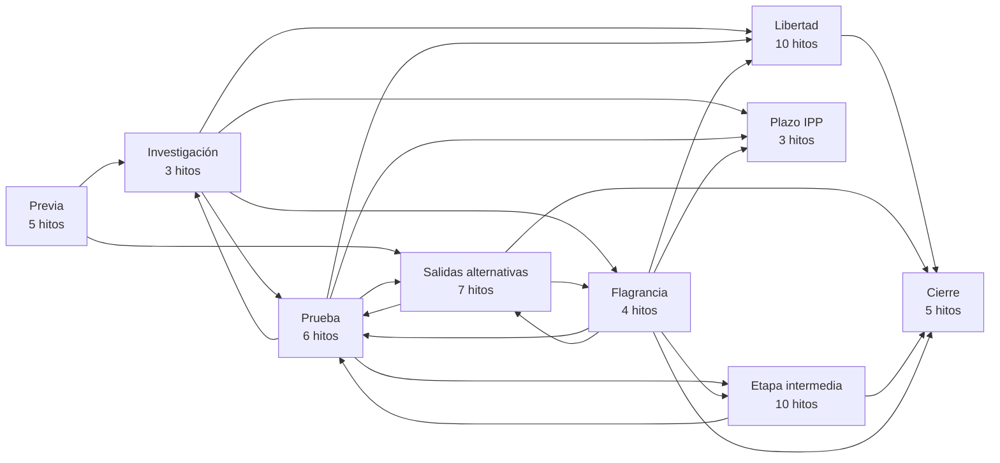

```mermaid
flowchart LR
  FASE_1["Previa<br/>5 hitos"]
  FASE_2["Investigación<br/>3 hitos"]
  FASE_3["Libertad<br/>10 hitos"]
  FASE_4["Prueba<br/>6 hitos"]
  FASE_5["Plazo IPP<br/>3 hitos"]
  FASE_6["Salidas alternativas<br/>7 hitos"]
  FASE_7["Etapa intermedia<br/>10 hitos"]
  FASE_8["Flagrancia<br/>4 hitos"]
  FASE_9["Cierre<br/>5 hitos"]
  FASE_1 --> FASE_2
  FASE_1 --> FASE_6
  FASE_2 --> FASE_3
  FASE_2 --> FASE_4
  FASE_2 --> FASE_5
  FASE_2 --> FASE_8
  FASE_3 --> FASE_9
  FASE_4 --> FASE_2
  FASE_4 --> FASE_3
  FASE_4 --> FASE_5
  FASE_4 --> FASE_6
  FASE_4 --> FASE_7
  FASE_6 --> FASE_9
  FASE_6 --> FASE_4
  FASE_6 --> FASE_8
  FASE_7 --> FASE_4
  FASE_7 --> FASE_9
  FASE_8 --> FASE_4
  FASE_8 --> FASE_5
  FASE_8 --> FASE_9
  FASE_8 --> FASE_6
  FASE_8 --> FASE_7
  FASE_8 --> FASE_3
```
