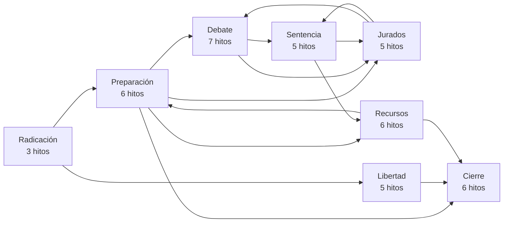

```mermaid
flowchart LR
  FASE_1["Radicación<br/>3 hitos"]
  FASE_2["Preparación<br/>6 hitos"]
  FASE_3["Jurados<br/>5 hitos"]
  FASE_4["Debate<br/>7 hitos"]
  FASE_5["Libertad<br/>5 hitos"]
  FASE_6["Sentencia<br/>5 hitos"]
  FASE_7["Recursos<br/>6 hitos"]
  FASE_8["Cierre<br/>6 hitos"]
  FASE_1 --> FASE_2
  FASE_1 --> FASE_5
  FASE_2 --> FASE_8
  FASE_2 --> FASE_7
  FASE_2 --> FASE_4
  FASE_2 --> FASE_3
  FASE_5 --> FASE_8
  FASE_3 --> FASE_4
  FASE_3 --> FASE_6
  FASE_4 --> FASE_6
  FASE_4 --> FASE_3
  FASE_6 --> FASE_3
  FASE_6 --> FASE_7
  FASE_7 --> FASE_8
  FASE_7 --> FASE_2
```
