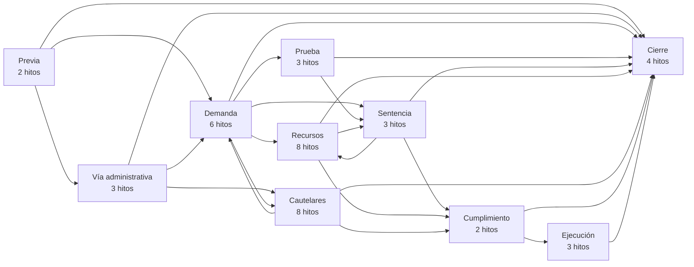

```mermaid
flowchart LR
  FASE_1["Previa<br/>2 hitos"]
  FASE_2["Vía administrativa<br/>3 hitos"]
  FASE_3["Demanda<br/>6 hitos"]
  FASE_4["Cautelares<br/>8 hitos"]
  FASE_5["Prueba<br/>3 hitos"]
  FASE_6["Sentencia<br/>3 hitos"]
  FASE_7["Recursos<br/>8 hitos"]
  FASE_8["Cumplimiento<br/>2 hitos"]
  FASE_9["Ejecución<br/>3 hitos"]
  FASE_10["Cierre<br/>4 hitos"]
  FASE_1 --> FASE_2
  FASE_1 --> FASE_3
  FASE_1 --> FASE_10
  FASE_2 --> FASE_10
  FASE_2 --> FASE_3
  FASE_2 --> FASE_4
  FASE_3 --> FASE_10
  FASE_3 --> FASE_4
  FASE_3 --> FASE_7
  FASE_3 --> FASE_5
  FASE_3 --> FASE_6
  FASE_5 --> FASE_6
  FASE_5 --> FASE_10
  FASE_6 --> FASE_7
  FASE_6 --> FASE_8
  FASE_6 --> FASE_10
  FASE_7 --> FASE_8
  FASE_7 --> FASE_10
  FASE_4 --> FASE_8
  FASE_4 --> FASE_10
  FASE_4 --> FASE_3
  FASE_8 --> FASE_10
  FASE_8 --> FASE_9
  FASE_7 --> FASE_6
  FASE_9 --> FASE_10
```
