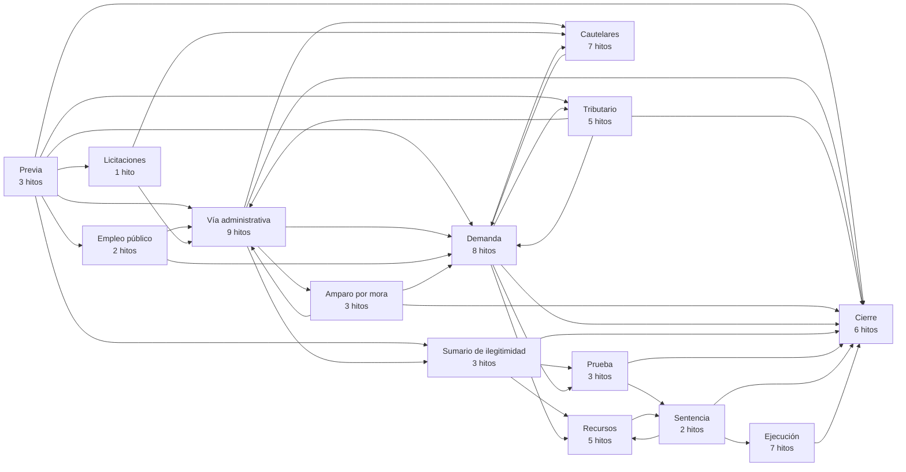

```mermaid
flowchart LR
  FASE_1["Previa<br/>3 hitos"]
  FASE_2["Vía administrativa<br/>9 hitos"]
  FASE_3["Empleo público<br/>2 hitos"]
  FASE_4["Tributario<br/>5 hitos"]
  FASE_5["Licitaciones<br/>1 hito"]
  FASE_6["Amparo por mora<br/>3 hitos"]
  FASE_7["Demanda<br/>8 hitos"]
  FASE_8["Sumario de ilegitimidad<br/>3 hitos"]
  FASE_9["Cautelares<br/>7 hitos"]
  FASE_10["Prueba<br/>3 hitos"]
  FASE_11["Sentencia<br/>2 hitos"]
  FASE_12["Recursos<br/>5 hitos"]
  FASE_13["Ejecución<br/>7 hitos"]
  FASE_14["Cierre<br/>6 hitos"]
  FASE_1 --> FASE_2
  FASE_1 --> FASE_3
  FASE_1 --> FASE_4
  FASE_1 --> FASE_5
  FASE_1 --> FASE_7
  FASE_1 --> FASE_8
  FASE_1 --> FASE_14
  FASE_2 --> FASE_14
  FASE_2 --> FASE_6
  FASE_2 --> FASE_7
  FASE_2 --> FASE_8
  FASE_2 --> FASE_9
  FASE_3 --> FASE_2
  FASE_3 --> FASE_7
  FASE_4 --> FASE_2
  FASE_4 --> FASE_7
  FASE_4 --> FASE_14
  FASE_5 --> FASE_2
  FASE_5 --> FASE_9
  FASE_6 --> FASE_2
  FASE_6 --> FASE_14
  FASE_6 --> FASE_7
  FASE_7 --> FASE_14
  FASE_8 --> FASE_14
  FASE_8 --> FASE_10
  FASE_8 --> FASE_12
  FASE_7 --> FASE_9
  FASE_7 --> FASE_4
  FASE_7 --> FASE_12
  FASE_7 --> FASE_10
  FASE_10 --> FASE_11
  FASE_10 --> FASE_14
  FASE_11 --> FASE_12
  FASE_9 --> FASE_7
  FASE_12 --> FASE_11
  FASE_11 --> FASE_13
  FASE_11 --> FASE_14
  FASE_13 --> FASE_14
```
