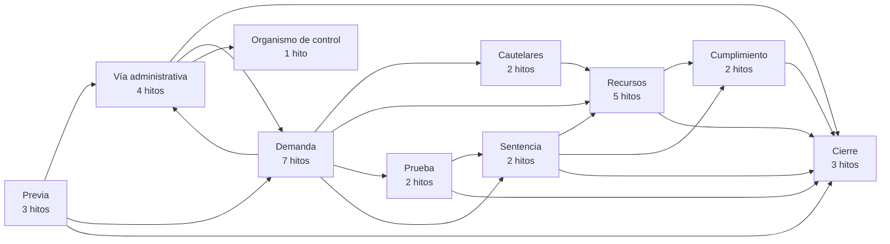

```mermaid
flowchart LR
  FASE_1["Previa<br/>3 hitos"]
  FASE_2["Vía administrativa<br/>4 hitos"]
  FASE_3["Organismo de control<br/>1 hito"]
  FASE_4["Demanda<br/>7 hitos"]
  FASE_5["Cautelares<br/>2 hitos"]
  FASE_6["Prueba<br/>2 hitos"]
  FASE_7["Sentencia<br/>2 hitos"]
  FASE_8["Recursos<br/>5 hitos"]
  FASE_9["Cumplimiento<br/>2 hitos"]
  FASE_10["Cierre<br/>3 hitos"]
  FASE_1 --> FASE_2
  FASE_1 --> FASE_4
  FASE_2 --> FASE_10
  FASE_2 --> FASE_4
  FASE_2 --> FASE_3
  FASE_1 --> FASE_10
  FASE_4 --> FASE_5
  FASE_4 --> FASE_2
  FASE_4 --> FASE_8
  FASE_5 --> FASE_8
  FASE_4 --> FASE_6
  FASE_4 --> FASE_7
  FASE_6 --> FASE_7
  FASE_7 --> FASE_8
  FASE_7 --> FASE_9
  FASE_7 --> FASE_10
  FASE_8 --> FASE_9
  FASE_8 --> FASE_10
  FASE_6 --> FASE_10
  FASE_9 --> FASE_10
```
